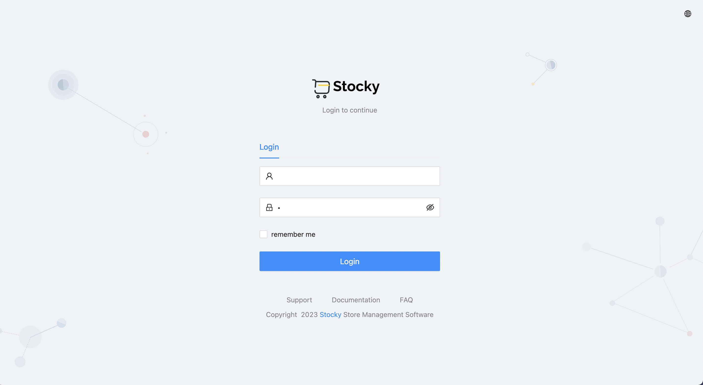
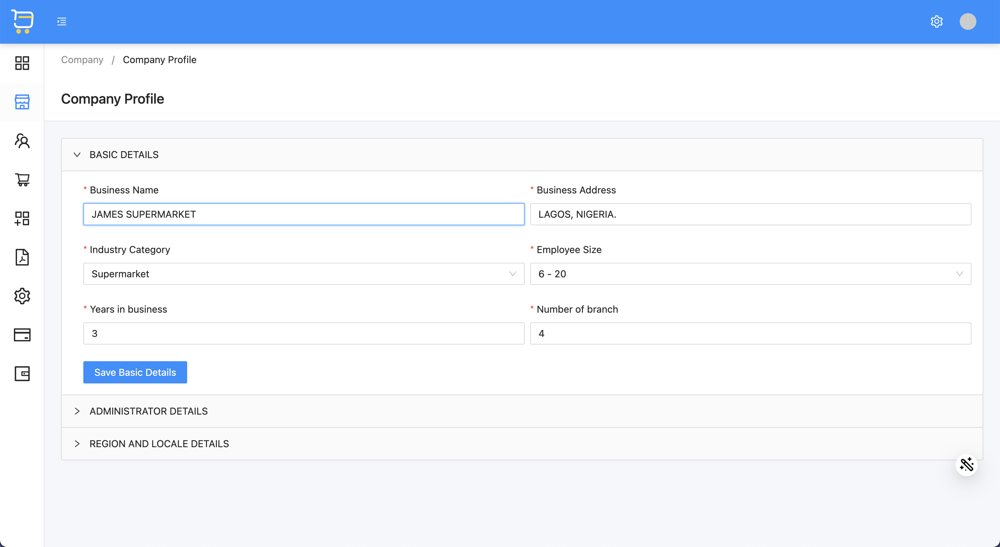
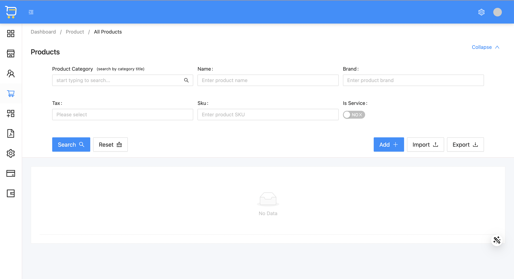
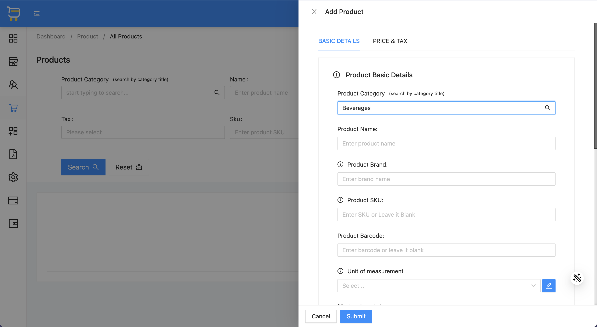
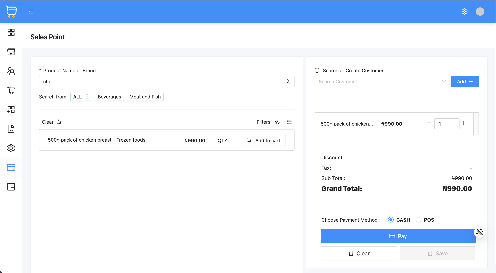
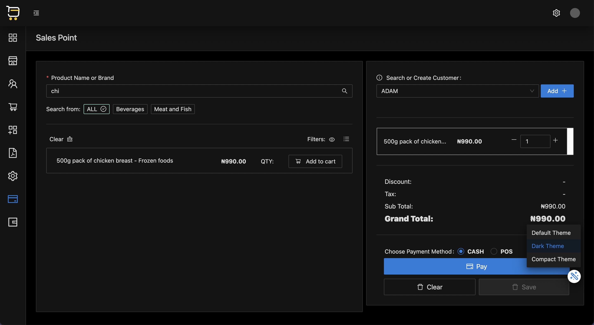
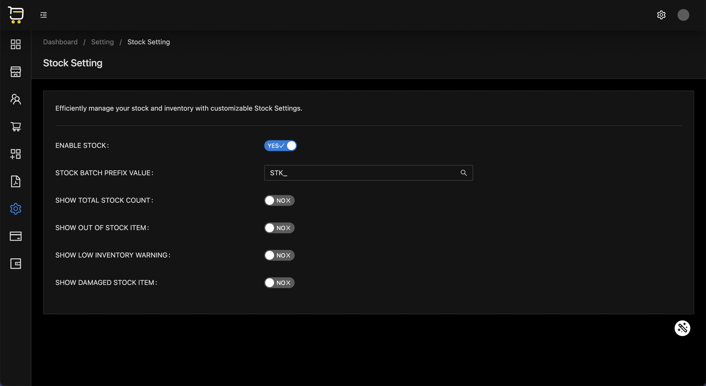
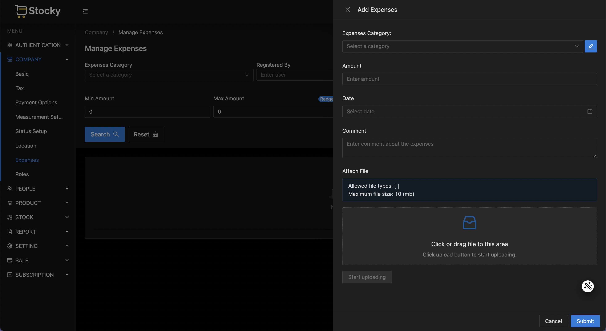

# Stocky

Stocky is a fullstack web application built with Java, Spring Boot, and Angular that helps busy store owners manage all
of their stores in one place. This app is designed to be both performant and user-friendly.

## Screenshot

See a Live Demo Here: [stocky.jamesaworo.com](https://stocky.jamesaworo.com)

- Login screen

 

- Setup Company

 

- Manage products

 

- Add products

 

- Sales Point

 

- Sales Point (Dark Mode)

 

- Stock Settings (Dark Mode)

 

- Add expenses

 

## Features

- User authentication and authorization system
- Stock and inventory management
- Company, customers and employee management
- Product and product category management
- Reports and analytics
- Settings and application configuration
- Search and filter functionality for easy product discovery

## Technologies

Stocky is built using the following technologies and tools:

## Installation

To run Stocky locally, follow these steps:

1. Clone the repository:
   `git clone https://github.com/your-username/stocky.git`

2. Navigate to the project directory: `cd stocky`
3. Install dependencies: `mvn install`
4. Start the backend server: `mvn spring-boot:run`
5. Stocky should now be running at `http://localhost:8080`

## Usage

After successful installation, follow the steps below:

- Set up company profile
    - Goto Company and update company information, administrator information, language and currency.
    - save to apply changes.
- Add product categories
    - Add all your product categories
    - Add or upload product using an Excel sheet.
- Start selling.

## Author

[Aworo James: james.aworo@outlook.com](james.aworo@outlook.com)

## License

Stocky is released under the MIT License.

